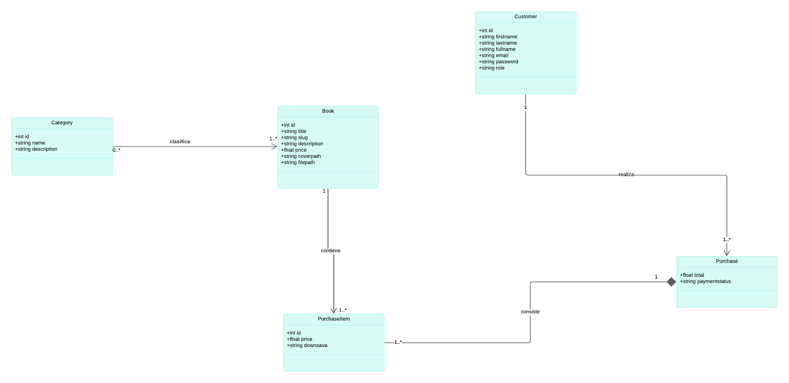
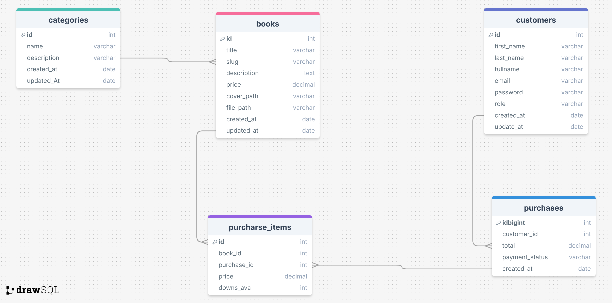

# BookHub

## Índice
- [BookHub Store](#bookhub-store)
  - [Índice](#índice)
  - [Introducción](#introducción)
    - [Características Principales](#características-principales)
  - [Diagramas de la Aplicación](#diagramas-de-la-aplicación)
    - [Diagrama de Clases](#diagrama-de-clases)
    - [Diagrama de Base de Datos](#diagrama-de-base-de-datos)
  - [Actividades de la Sesión 1](#actividades-de-la-sesión-1)
  
## Introducción

**BookHub** es una aplicación web diseñada para facilitar la compra de libros electrónicos, con integración de pagos a través de PayPal y administración eficiente de los datos de libros, categorías y autores. La aplicación permite a los administradores realizar operaciones CRUD (Crear, Leer, Actualizar, Eliminar) sobre libros, categorías y autores, gestionando de manera sencilla tanto el catálogo de libros como las transacciones de compra realizadas por los clientes.

### Funcionalidades de la Aplicación BookHub

- **Compra de Libros Electrónicos:**  
  Integración con PayPal para realizar pagos seguros y rápidos, permitiendo a los usuarios comprar libros electrónicos de manera eficiente.

- **Gestión de Libros:**  
  Funcionalidades para añadir, editar, eliminar y listar libros disponibles, asegurando una gestión eficaz del catálogo de la aplicación.

- **Categorías de Libros:**  
  Clasificación de libros en diferentes categorías para facilitar la navegación y búsqueda por parte de los usuarios, mejorando la experiencia del usuario.

- **Gestión de Autores:**  
  Funcionalidades CRUD (Crear, Leer, Actualizar, Eliminar) para manejar la información de los autores, permitiendo mantener actualizada la base de datos de autores relacionados con los libros.

- **Organización de Libros por el Usuario:**  
  Funcionalidades que permiten a los usuarios organizar sus libros comprados en colecciones personalizadas o "estanterías virtuales", facilitando así la gestión de su biblioteca personal y mejorando el acceso a los libros según sus preferencias.

- **Interfaz de Usuario Amigable:**  
  Un diseño intuitivo que facilita la administración de libros, categorías y autores, así como el proceso de compra para los usuarios, mejorando la usabilidad y accesibilidad de la aplicación.

## Diagramas de la Aplicación

Para entender mejor la estructura y diseño de la aplicación "BookHub", revisa los siguientes diagramas:

### Diagrama de Clases

### Diagrama de Base de Datos

Este diagrama ilustra el esquema de la base de datos utilizada por la aplicación, mostrando las tablas, columnas, y relaciones entre las entidades.

## Actividades de la Sesión 1

En esta sesión abarcaremos las siguientes actividades para configurar y desarrollar la API de la aplicación:

1. **Preparación de la Base de Datos**
   - Configuración de la base de datos para almacenar la información de libros y categorías.

2. **Diseño de la API**
   - Planificación de los endpoints necesarios para gestionar las entidades de la aplicación.

3. **Creación del Proyecto para la API**
   - Configuración inicial del proyecto utilizando el framework de tu elección (por ejemplo, Spring Boot para Java).

4. **Implementación de los Endpoints para Gestionar las Categorías y Libros**
   - **Mapeo de la Entidad `Category`, `Author` y `Book`**: Definición de las entidades de categoría, autor y libro, con sus respectivas relaciones.
   - **Creación del Repositorio**: Implementación de los repositorios para interactuar con la base de datos.
   - **Creación del Controlador**: Desarrollo de controladores REST para manejar las solicitudes HTTP relacionadas con libros, categorías y autores.
   - **Creación del Servicio**: Implementación de la lógica de negocio en servicios para manejar las operaciones CRUD.

---

