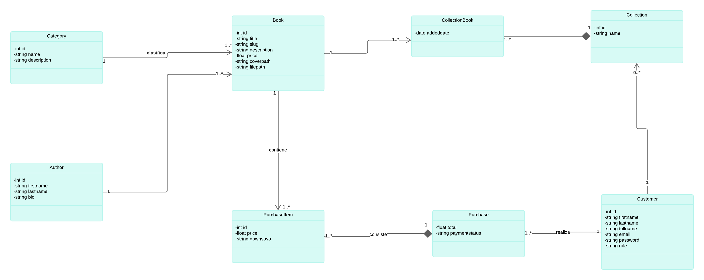
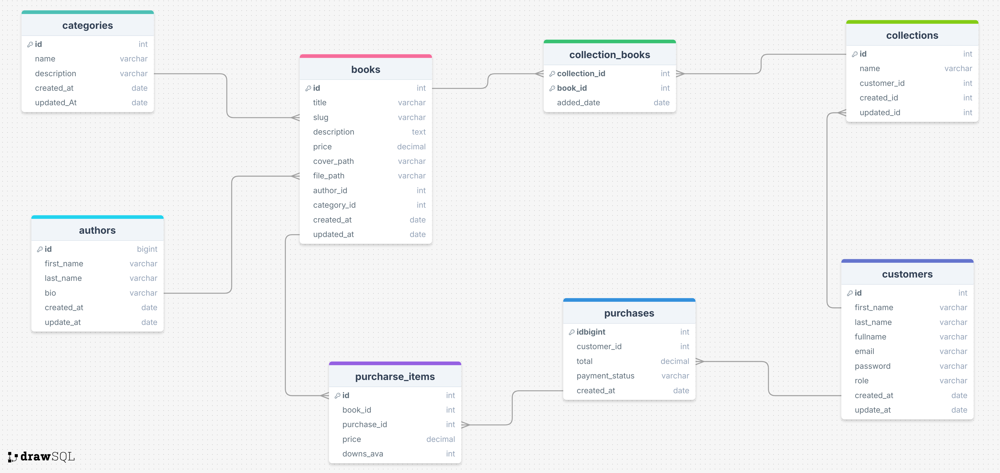

# Ebook Store 

## Índice

- [Ebook Store](#ebook-store)
  - [Índice](#índice)
  - [Introducción](#introducción)
    - [Características Principales](#características-principales)
  - [Diagramas de la Aplicación](#diagramas-de-la-aplicación)
    - [Diagrama de Clases](#diagrama-de-clases)
    - [Diagrama de Base de Datos](#diagrama-de-base-de-datos)
  - [Actividades de la Sesión 1](#actividades-de-la-sesión-1)
  
## Introducción

**Ebook Store Book** es una aplicación web diseñada para facilitar la compra de libros electrónicos, con integración de pagos a través de PayPal, así como la administración eficiente de los datos de libros y categorías. La aplicación permite a los administradores realizar operaciones CRUD (Crear, Leer, Actualizar, Eliminar) sobre libros y categorías, gestionando de manera sencilla tanto el inventario de libros como las transacciones de compra realizadas por los clientes.

### Características Principales

- **Compra de Libros Electrónicos**: Integración con PayPal para realizar pagos seguros y rápidos.
- **Gestión de Libros**: Funcionalidades para añadir, editar, eliminar y listar libros disponibles en la tienda.
- **Categorías de Libros**: Clasificación de libros en diferentes categorías para facilitar la navegación y búsqueda.
- **Interfaz de Usuario Amigable**: Un diseño intuitivo que facilita la administración de libros y categorías, así como el proceso de compra para los usuarios.

## Diagramas de la Aplicación

Para entender mejor la estructura y diseño de la aplicación "Ebook Store", revisa los siguientes diagramas:

### Diagrama de Clases

### Diagrama de Base de Datos

Este diagrama ilustra el esquema de la base de datos utilizada por la aplicación, mostrando las tablas, columnas, y relaciones entre las entidades.

## Actividades de la Sesión 1

En esta sesión abarcaremos las siguientes actividades para configurar y desarrollar la API de la aplicación:

1. **Preparación de la Base de Datos**
   - Configuración de la base de datos para almacenar la información de libros y categorías.

2. **Diseño de la API**
   - Planificación de los endpoints necesarios para gestionar las entidades de la aplicación.

3. **Creación del Proyecto para la API**
   - Configuración inicial del proyecto utilizando el framework de tu elección (por ejemplo, Spring Boot para Java).

4. **Implementación de los Endpoints para Gestionar las Categorías y Libros**
   - **Mapeo de la Entidad `Category` y `Book`**: Definición de las entidades de categoría y libro, con sus respectivas relaciones.
   - **Creación del Repositorio**: Implementación de los repositorios para interactuar con la base de datos.
   - **Creación del Controlador**: Desarrollo de controladores REST para manejar las solicitudes HTTP relacionadas con libros y categorías.
   - **Creación del Servicio**: Implementación de la lógica de negocio en servicios para manejar las operaciones CRUD.

---

